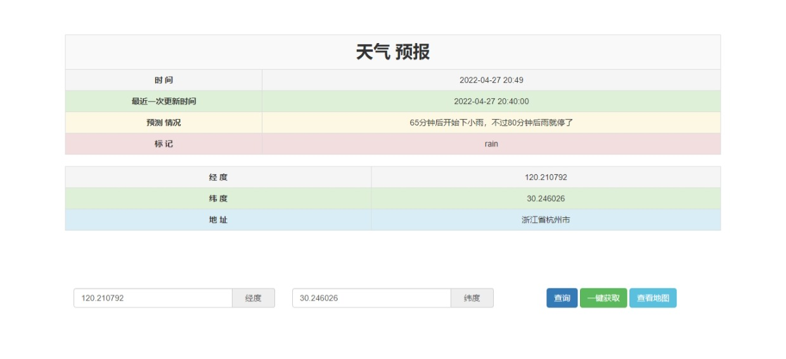

[](https://github.com/Vogadero/WeatherForecast)


# 项目简介🚩

- 天气预报
- 演示地址：https://vogadero.github.io/WeatherForecast/

## 1. 功能模块🎨

#### 1.1 首页🛫

| 功能                                  |
| ------------------------------------- |
| 一键获取当前ip经纬度信息              |
| 查询当前经纬度地址未来2小时的天气情况 |
| 查看当前经纬度地址的地图              |

## 2. 截图⭐



## 3. 项目架构🍽️

| 系统分层 | 使用技术                        |
| -------- | ------------------------------- |
| 客户端   | Art-template、jQuery、bootstrap |

## 4. 项目运行环境搭建🌈

- 克隆远端数据仓库到本地：`git clone 仓库地址`
- 拉取远程仓库中最新的版本：`git pull 远程仓库地址 分支名称`
- 双击index.html

# 功能介绍🦷

## 🕵️‍♀️一键获取

- 展示内容：当前ip经纬度以及地址

- API

  - 地址：https://api.asilu.com/geo

  - 方式：GET

  - 参数类型：jsonp

    


## :card_index:**查询**

- 展示内容：根据当前经纬度展示未来2小时天气情况

- API

  - 地址：https://query.asilu.com/weather/now

  - 方式：GET

  - 参数类型：jsonp

  - 参数：

    | 参数名 | 说明 |
    | ------ | ---- |
    | lat    | 纬度 |
    | lng    | 经度 |

    


## :woman_technologist:**查看地图**

- 展示内容：当前经纬度地址的详细地图

  

# Tree🌵    


```
天气预报
├─ 01.jpeg 
├─ assets
│  └─ bootstrap
│     ├─ CHANGELOG.md
│     ├─ dist
│     │  ├─ css
│     │  │  ├─ bootstrap-theme.css
│     │  │  ├─ bootstrap-theme.css.map
│     │  │  ├─ bootstrap-theme.min.css
│     │  │  ├─ bootstrap-theme.min.css.map
│     │  │  ├─ bootstrap.css
│     │  │  ├─ bootstrap.css.map
│     │  │  ├─ bootstrap.min.css
│     │  │  └─ bootstrap.min.css.map
│     │  ├─ fonts
│     │  │  ├─ glyphicons-halflings-regular.eot
│     │  │  ├─ glyphicons-halflings-regular.svg
│     │  │  ├─ glyphicons-halflings-regular.ttf
│     │  │  ├─ glyphicons-halflings-regular.woff
│     │  │  └─ glyphicons-halflings-regular.woff2
│     │  └─ js
│     │     ├─ bootstrap.js
│     │     ├─ bootstrap.min.js
│     │     └─ npm.js
│     ├─ fonts
│     │  ├─ glyphicons-halflings-regular.eot
│     │  ├─ glyphicons-halflings-regular.svg
│     │  ├─ glyphicons-halflings-regular.ttf
│     │  ├─ glyphicons-halflings-regular.woff
│     │  └─ glyphicons-halflings-regular.woff2
│     ├─ grunt
│     │  ├─ .jshintrc
│     │  ├─ bs-commonjs-generator.js
│     │  ├─ bs-glyphicons-data-generator.js
│     │  ├─ bs-lessdoc-parser.js
│     │  ├─ bs-raw-files-generator.js
│     │  ├─ change-version.js
│     │  ├─ configBridge.json
│     │  ├─ npm-shrinkwrap.json
│     │  └─ sauce_browsers.yml
│     ├─ Gruntfile.js
│     ├─ js
│     │  ├─ affix.js
│     │  ├─ alert(1).js
│     │  ├─ button.js
│     │  ├─ carousel.js
│     │  ├─ collapse.js
│     │  ├─ dropdown.js
│     │  ├─ modal.js
│     │  ├─ popover.js
│     │  ├─ scrollspy.js
│     │  ├─ tab.js
│     │  ├─ tooltip.js
│     │  └─ transition.js
│     ├─ less
│     │  ├─ alerts.less
│     │  ├─ badges.less
│     │  ├─ bootstrap.less
│     │  ├─ breadcrumbs.less
│     │  ├─ button-groups.less
│     │  ├─ buttons.less
│     │  ├─ carousel.less
│     │  ├─ close.less
│     │  ├─ code.less
│     │  ├─ component-animations.less
│     │  ├─ dropdowns.less
│     │  ├─ forms.less
│     │  ├─ glyphicons.less
│     │  ├─ grid.less
│     │  ├─ input-groups.less
│     │  ├─ jumbotron.less
│     │  ├─ labels.less
│     │  ├─ list-group.less
│     │  ├─ media.less
│     │  ├─ mixins
│     │  │  ├─ alerts.less
│     │  │  ├─ background-variant.less
│     │  │  ├─ border-radius.less
│     │  │  ├─ buttons.less
│     │  │  ├─ center-block.less
│     │  │  ├─ clearfix.less
│     │  │  ├─ forms.less
│     │  │  ├─ gradients.less
│     │  │  ├─ grid-framework.less
│     │  │  ├─ grid.less
│     │  │  ├─ hide-text.less
│     │  │  ├─ image.less
│     │  │  ├─ labels.less
│     │  │  ├─ list-group.less
│     │  │  ├─ nav-divider.less
│     │  │  ├─ nav-vertical-align.less
│     │  │  ├─ opacity.less
│     │  │  ├─ pagination.less
│     │  │  ├─ panels.less
│     │  │  ├─ progress-bar.less
│     │  │  ├─ reset-filter.less
│     │  │  ├─ reset-text.less
│     │  │  ├─ resize.less
│     │  │  ├─ responsive-visibility.less
│     │  │  ├─ size.less
│     │  │  ├─ tab-focus.less
│     │  │  ├─ table-row.less
│     │  │  ├─ text-emphasis.less
│     │  │  ├─ text-overflow.less
│     │  │  └─ vendor-prefixes.less
│     │  ├─ mixins.less
│     │  ├─ modals.less
│     │  ├─ navbar.less
│     │  ├─ navs.less
│     │  ├─ normalize.less
│     │  ├─ pager.less
│     │  ├─ pagination.less
│     │  ├─ panels.less
│     │  ├─ popovers.less
│     │  ├─ print.less
│     │  ├─ progress-bars.less
│     │  ├─ responsive-embed.less
│     │  ├─ responsive-utilities.less
│     │  ├─ scaffolding.less
│     │  ├─ tables.less
│     │  ├─ theme.less
│     │  ├─ thumbnails.less
│     │  ├─ tooltip.less
│     │  ├─ type.less
│     │  ├─ utilities.less
│     │  ├─ variables.less
│     │  └─ wells.less
│     ├─ LICENSE
│     ├─ package.json
│     └─ README.md
├─ index.html
├─ js
│  ├─ jquery-3.6.0.min.js
│  └─ template-web.js
├─ README.md
└─ 天气预报.ico
```